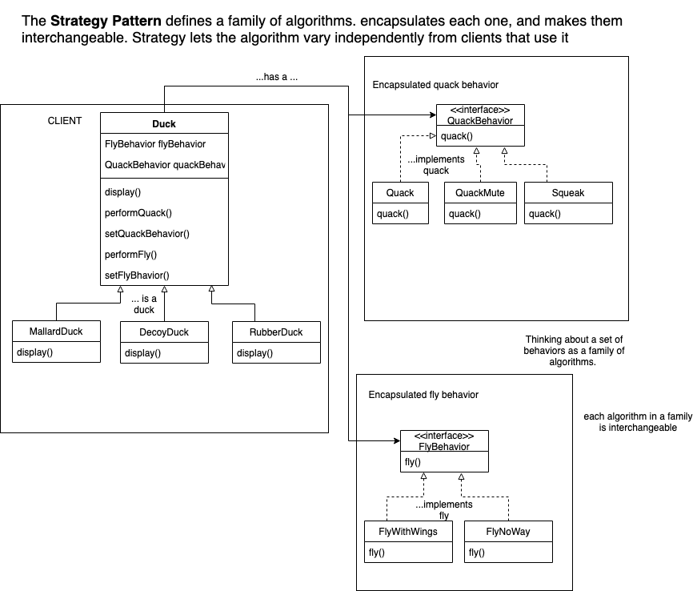

# HeadFirstDesign

#### ducks aka Ch. 1 intro to Design Patterns
 - **id aspects of app that vary and seperate them from what stays the same.**
      - encapsulate what varys so that it doesn't affect rest of code.
      - Ducks can have different types of behaviors for quacking and flying. 
  - **program to an interface not an implementation**   
      - Duck class does not implement quack and fly behaviors 
      - behavior classes implement behavior interfaces
      
  - **Favor composition over inheritance**
  
  RESULT -> benefit of REUSE w/o all the baggage that comes along w/ inheritance
  - other types of objects can reuse fly and quack behaviors 
  - new behaviors can be added w/o modifiying existing behavior classes or Duck classes
  
  
  
